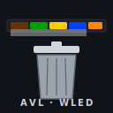

# avl-wled



Small Linux service that watches an AVL waste-collection iCal feed and drives
a [WLED](https://kno.wled.ge/) strip to remind you that the bin needs to go
out. Written in C++17, single binary, only depends on `libcurl` and the
standard library.

## What it does

- Once a week: downloads the configured iCal URL.
- Once an hour:
  - drops past events,
  - if an unacknowledged event is within **3h** → status segment goes
    *urgent* (default red) regardless of the time of day,
  - if an unacknowledged event is within **24h** → status segment goes
    *normal* (default green), but only outside configured night hours.
- For every active event, an extra LED segment is lit in a color derived
  from the event's `SUMMARY` (configurable keyword → color map).
- A small built-in HTTP endpoint (`/ack`) removes the oldest active
  reminder. Hit it from a wall-mounted button, Home Assistant, a phone
  shortcut, whatever.
- State (acknowledged event UIDs) is persisted, so a restart does not
  resurrect dismissed reminders.

LED layout while N events are active:

```
[ status | event 1 | event 2 | ... | event N ]
```

`status` is red if any active event is urgent, otherwise green. Each event
segment uses the color mapped from its iCal `SUMMARY`.

## Build & install

Requires `g++`, `make`, and the libcurl development headers.

```sh
# Debian/Ubuntu
sudo apt install build-essential libcurl4-openssl-dev

# Fedora/RHEL/openSUSE
sudo zypper install gcc-c++ make libcurl-devel    # or dnf
```

Then:

```sh
sudo ./install.sh
sudo $EDITOR /etc/avl-wled.conf      # set ical_url and wled_host
sudo systemctl enable --now avl-wled
journalctl -u avl-wled -f
```

The installer:

- builds `avl-wled`,
- installs it to `/usr/local/bin`,
- installs `/etc/avl-wled.conf` (only if absent — re-running won't clobber
  your config),
- installs the systemd unit to `/etc/systemd/system/avl-wled.service`,
- creates a system user `avl-wled` and `/var/lib/avl-wled/`.

To build by hand without installing:

```sh
make
./avl-wled --config=./avl-wled.conf
```

## Configuration

All settings live in `/etc/avl-wled.conf` as `key = value` pairs. Every key
can be overridden on the command line with `--key=value` (or `--key value`).

| Key | Default | Meaning |
| --- | --- | --- |
| `ical_url` | — | Public AVL iCal URL (required) |
| `wled_host` | — | WLED host or `host:port` (required) |
| `state_file` | `/var/lib/avl-wled/acked` | Acknowledged UIDs |
| `ical_cache` | `/var/lib/avl-wled/calendar.ics` | Downloaded iCal cache |
| `fetch_interval` | `604800` | Seconds between iCal downloads |
| `check_interval` | `3600` | Seconds between calendar evaluations |
| `urgent_window` | `10800` | "Urgent" threshold (s before event) |
| `warn_window` | `86400` | "Warn" threshold (s before event) |
| `night_start` / `night_end` | `22` / `7` | Local hours; warn is suppressed during night |
| `http_port` | `8765` | Port for `/ack` and `/status` |
| `led_count` | `60` | Total LEDs on the strip |
| `wled_brightness` | `128` | 0–255 |
| `max_segments` | `8` | Upper bound on WLED segments to touch |
| `urgent_color` / `normal_color` | `FF0000` / `00FF00` | Status segment colors |
| `color_<keyword>` | — | Map: lowercase substring of SUMMARY → `RRGGBB` |

Example overrides:

```sh
avl-wled --config=/etc/avl-wled.conf --check_interval=600 --wled_host=192.168.1.42
```

### Mapping waste types to colors

Each `color_<keyword>` line defines one keyword (case-insensitive) to look
for in the iCal `SUMMARY`. The first matching entry wins; if nothing
matches, `normal_color` is used. Add as many as you need:

```
color_restmuell = 202020
color_bio       = 663300
color_papier    = 0040FF
color_gelb      = FFCC00
color_sperr     = 800080
```

## Acknowledging

The service exposes two HTTP endpoints on `http_port`:

- `GET /ack` (or `POST /ack`) — drop the oldest currently-active reminder.
  WLED is updated immediately. Returns plain text.
- `GET /status` — print number of events, acked entries, and the active
  list with timestamps.

Examples:

```sh
curl http://server:8765/ack
curl http://server:8765/status
```

Bind it to whatever you like — a Shelly button, a Home Assistant
automation, an `xdotool` keybind, an NFC tag, …

## Files

| Path | Purpose |
| --- | --- |
| `avl-wled.cpp` | Source |
| `Makefile` | Build & install targets |
| `install.sh` | Convenience installer (calls `make install`, sets up user/dirs/systemd) |
| `avl-wled.conf` | Example/default config |
| `avl-wled.service` | systemd unit (hardened, `StateDirectory=avl-wled`) |

## Uninstall

```sh
sudo systemctl disable --now avl-wled
sudo make uninstall
sudo rm -rf /var/lib/avl-wled /etc/avl-wled.conf
sudo userdel avl-wled
```
